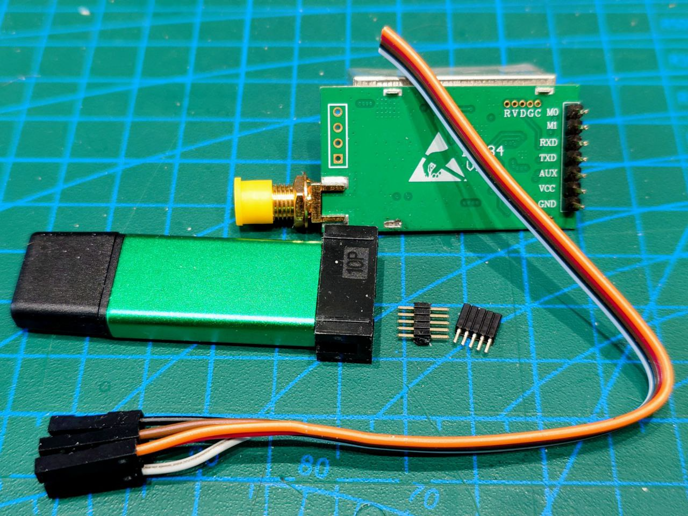
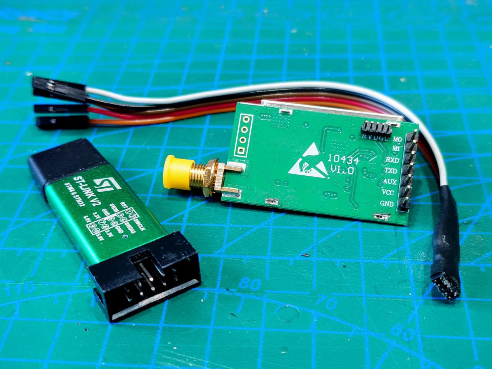
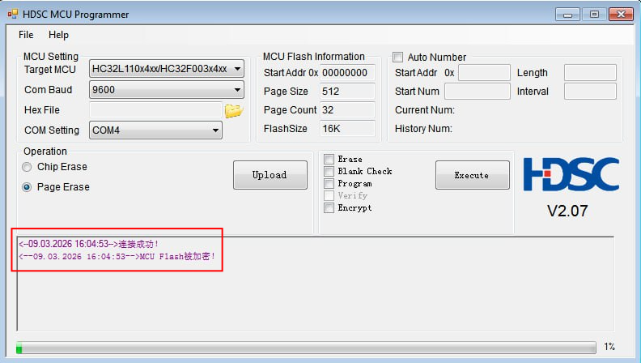
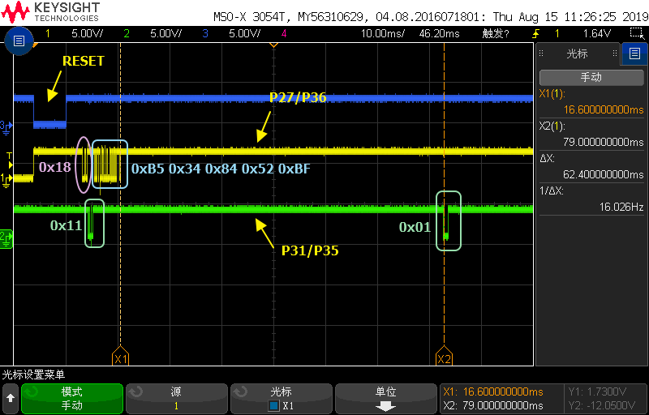
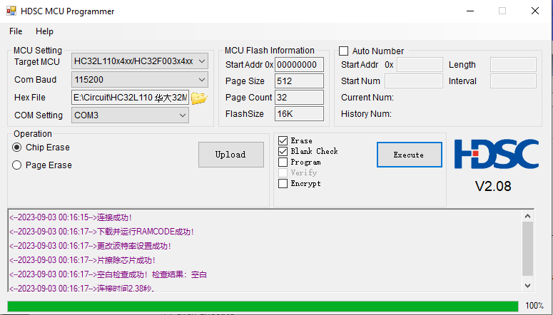
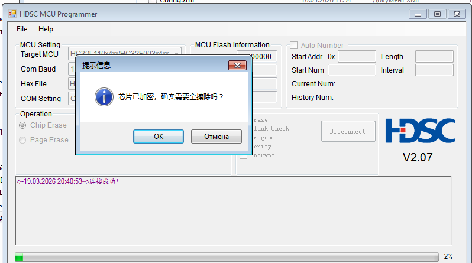
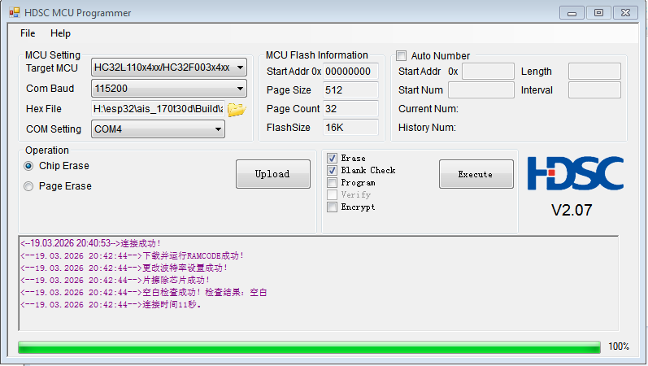
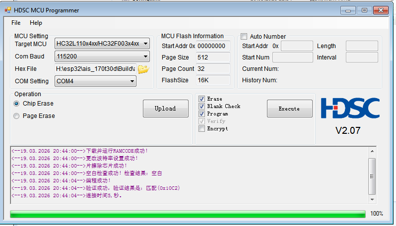
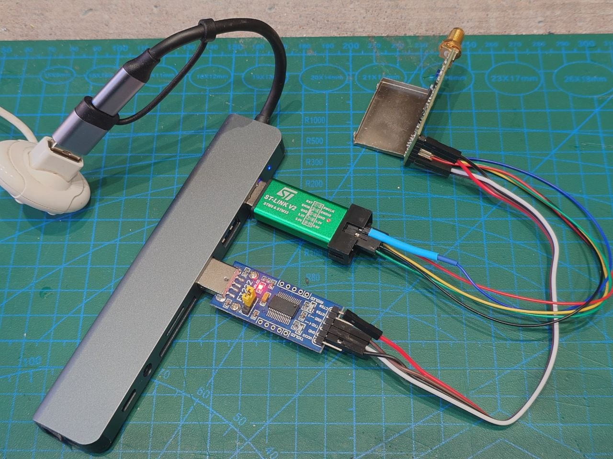

# Приемник AIS на базе модуля [E32 170T30D](https://www.cdebyte.com/products/E32-170T30D/1) от EByte

## Задачи
1. Определиться с архитектурой приемника: один MCU+USB мост, два MCU и тп
2. Разобраться с программированием и прошивкой MCU HL32L110
3. Отладить прием реального AIS сигнала с преобразованием в NMEA 0183
4. Измерить основные характеристики: чувствительность, потребляемая мощность и тп 

## Софт
1. Операционная система Ubuntu Ubuntu 24.04.3 LTS
2. Visual Studio Code v1.108.2 с Platformio v 3.3.4
3. [EasyEDA](https://easyeda.com/) онлайн IDE для разработки радиосхем

## Железо
1. Плата [E32 170T30D](https://www.cdebyte.com/products/E32-170T30D/1)
2. Плата ESP32 doit-devkit-v1
3. Китайский ST-link v2 для прошивки MCU

## Определяемся с архитектурой
### Схема (частично) модуля E32 170T30D

Первичный обзор платы был приведен [здесь](https://github.com/wla-da/ais_lab_tools/blob/main/rf/README.md). В моем варианте платы используется радиочип [SX1278](https://github.com/wla-da/ais_lab_tools/blob/main/rf/datascheet/SX1278.pdf) и MCU [HC32L110C4UA](https://github.com/wla-da/ais_lab_tools/blob/main/rf/datascheet/HC32L110SeriesDatasheet_Rev2.70.pdf). 


#### С чем предстоит разобраться?

1. Понять разводку между радиочипом SX1278 и MCU HC32L110C4UA
2. Оценить, будет ли способен MCU HC32L110C4UA "на лету" декодировать AIS поток с преобразованием в NMEA 0183
3. Провести эксперименты по приему сигнала AIS, сделать кастомную прошивку HC32L110C4UA

Для работы радиочипа SX1278 в Continuous mode (а не в пакетном режиме, как необходимо для LoRa) и аппаратном детектировании [AIS преамбулы](https://github.com/wla-da/ais_lab_tools/blob/main/demod/README.md#2-преамбула) необходимо считывать состояния выводов:
* DIO0 (или другой DIO3, DIO4, DIO5 - назначается программно через регистр) — Preamble Detect/Sync Address Detect, обнаружение преамбулы/синхрослова
* DIO1 — DCLK, Data Clock, битовая синхронизация
* DIO2 — Data, сырой битовый поток 
  
Опционально:
* DIO5 — Mode Ready/ClkOut, состояние чипа/тактирование


#### Фото платы крупным планом


Рис 1. Фото MCU и SX1278 крупным планом

На плате (сверху на фото) выведен разъем SWD (Serial Wire Debug) для перепрошивки MCU с подключением напрямую к P27 (SWDIO), P31 (SWCLK) и P00 (RESET) MCU.  Таким образом, можно не заморачиваться с режимом ISP (In-System Programming), утилиты HDSC ISP Tool которого от производителя MCU HDSC (Huada Semiconductor, также известного как XHSC) есть только под Windows. Хотя ISP работает по обычному UART через P35 (TXD MCU → RXD адаптера) и P36 (RXD MCU → TXD адаптера), которые выведены на плате в виде разъемов M0 и M1 соответственно. Еще потребуется вывод RESET (P00) для сброса MCU, который выведен на SWD разъем на плате. Перевод с китайского на русский гайда по прошивке MCU HC32 доступен [здесь](isp_hdsc/README.md).  Через ISP и UART прошивается проект [PenguinLRS](https://github.com/Penguin096/PenguinLRS/) под схожую плату от Ebyte.

После включения питания не забываем заземлить вход M0 платы, чтобы перевести радиомодуль из режима Sleep в Normal, см таблицу режимов работы. Так же стоит проверить выход платы AUX, должна быть логическая 1: плата готова к работе.


Рис 2. Таблица режимов работы E32-170T30D в зависимости от уровней M0 и M1


#### Схема подключения SX1278 и MCU на плате E32 170T30D 


Рис 3. Принципиальная схема (частично!) платы E32-170T30D 

Из особенностей платы E32 170T30D
1. Имеет 3 стабилизатора напряжения:  
    * LDO с обозначением "P1UH" (похож на XC6209) для питания MCU и радиочипа, работает постоянно
    * LDO 4A2D с управлением (вкл/выкл) от MCU (P34) для питания LNA для приемника 
    * импульсный мощный DC-DC конвертор, предположительно на чипе наподобие JW5250A, для отдельного RF усилителя мощности с управлением (вкл/выкл) от MCU (P33)
2. Есть отдельный LNA на базе предположительно NPN RF-транзистора наподобие BFG520
3. Есть отдельный усилитель мощности на базе, предположительно, RF-транзистора, идентифицировать модель которого не получилось
4. Есть RF ключ HWS421 для коммутации Rx/Tx с двумя входами управления, подключенными к P34 и P33 MCU (пины теже самые, что управляют вкл/выкл стабилизаторами напряжений)
5. Управлением режимов Rx/Tx занимается MCU, а не SX1278, вывод RXTX/RFMOD (20) у SX1278 не подключен к цепям
6. Установлен кварц на 26 МГц ровно, а не стандартный по даташиту [SX1278](https://github.com/wla-da/ais_lab_tools/blob/main/rf/datascheet/SX1278.pdf) кварц на 32 МГц. Да, я измерял частоту осциллографом, надпись на детали "T260" именно о частоте кварца.
7. Выводы DIO0-DIO5 SX1278 не подключены к цепям
8. Выведен разъем SWD для перепрошивки MCU с подключением напрямую к P27 (SWDIO), P31 (SWCLK) и P00 (RESET) MCU
9. У MCU остаются не задействованными P25 и P26


## Базовый алгоритм работы радиочипа

1) настраиваем физический уровень (частота канала AIS, битрейт, BT и тп) 
2) включаем пакетный режим, бит-синхронизатор в этом случае включается автоматически
3) устанавливаем детект преамбулы для AIS (скорее 2 байта из 3х, чтобы ловило и слабые сигналы) с учетом NRZI: 0xCC 0xCC 0xCC или 0x33 0x33 0x33
4) включаем автоподостройку частоты с автоматическим сбросом AfcAutoClearOn = 1, т.к. преамбула задана - AFC должна работать корректно 
5) опционально, задаем синхрослово в виде флага AIS 0x7E с учетом NRZI: 0xFE или 0x01
6) задаем фиксированную длину сообщения в 64 байта (обработка более длинных AIS сообщений - на будущее, пока игнорируем) 
7) выключаем проверку CRC 
8) ждем заполнения FIFO по флагу RxDone или PayloadReady или через регулярный опрос RegIrqFlags, затем читаем FIFO и передаем на UART для последующего декодирования (NRZI, бит дестаффинг, CRC, nmea и тп) на внешнем MCU

И всё было бы хорошо, если бы SX1278 поддерживал установку кастомной преамбулы. Но чип умеет обнаруживать преамбулу только с фиксированной последовательностью байт: либо 0x55 либо 0хAA (конкретное значение выбирается битом в регистре). А в нашем случае преамбула в эфире существует в виде NRZI кодированной последовательности байт 0xCC 0xCC 0xCC или 0x33 0x33 0x33 (в зависимости от начального бита). Как следствие, не срабатывает детектор преамбулы, не работает (корректно) AFC по преамбуле (так как зависит от работы FEI - Frequency Error Indicator), не работает (корректно) бит-синхронизатор, согласно даташиту на SX1278:

```
Для обеспечения корректной работы FEI:
* Измерение должно быть начато во время приема преамбулы.
* Сумма частотного смещения и полосы пропускания сигнала 20 дБ должна быть меньше полосы пропускания фильтра основной полосы, т.е. должен быть принят весь модулированный спектр.

.....

Для обеспечения корректной работы битового синхронизатора должны быть соблюдены следующие условия:
* Для синхронизации требуется преамбула (0x55 или 0xAA) длиной не менее 12 бит; чем длиннее фаза синхронизации, тем лучше будет последующая скорость обнаружения пакетов.
* Последующий битовый поток полезной нагрузки должен иметь как минимум один переход по фронту (восходящий или нисходящий) каждые 16 бит во время передачи данных.
* Абсолютная ошибка между скоростью передачи и приема битов не должна превышать 6,5%.
```

Остается попробовать по сути два варианта:
1. В пакетном режиме выключить детектор преамбулы, включить бит-синхронизатор, включить запуск AFC/AGC по RSII, настроить синхрослово как преамбула+флаг HDLC пакета в кодировке NRZI: 0xCC 0xCC 0xCC 0xFE (альтернативно 0x33 0x33 0x33 0x01).Из плюсов - не нужно паять/изменять модуль E32 170T30D. Предположительно, это даст весьма посредственный результат из-за нестабильной работы бит-синхронизатора. 
   
2. В непрерывном режиме включить запуск AFC/AGC по RSII и выключить:
    * детектор преамбулы 
    * поиск синхрослова 
    * бит-синхронизатор <br/>
Читать сырые данные с выхода DIO2 с оверсэмплингом х8/х16 и восстанавливать тактовую частоту бит уже в MCU (по сути, выполнить clock recovery). Дополнительно, нужно припаять DIO2 к свободному пину MCU. Предположительно, это даст максимальный эффект для приема AIS сигнала с помощью SX1278.  

Отдельный пункт - обязательно нужно ставить TXCO, так как 10-20 ppm температурного дрейфа обычного кварца делают прием почти невозможным, особенно в нашем случае, когда выключен AFC по преамбуле.

Значит, пора приступать к созданию прошивок HC32L110C4UA. Нужно подготовить среду разработки, установить и настроить toolchain, программатор и тп.

Для прошивки будем использовать [OpenOCD](https://openocd.org/) - opensource ПО для отладки, прошивки и тестирования микроконтроллеров и встроенных систем через интерфейсы JTAG или SWD.


## Сборка патченной версии OpenOCD от [Spritetm](https://github.com/Spritetm/openocd-hc32l110) для прошивки HC32L110

Опыт автора патча OpenOCD по прошивке HC32L110 описан [здесь](https://spritesmods.com/?art=hc32l110&page=3).

1. Установка зависимостей для сборки
```bash
sudo apt update
sudo apt install git autoconf libtool make pkg-config libusb-1.0-0-dev libhidapi-dev texinfo
```

2. Клонирование репозитория с патчами
```bash
git clone https://github.com/Spritetm/openocd-hc32l110.git
cd openocd-hc32l110
```

3. Конфигурация и сборка
```bash
# Сброс конфигурации (если ранее уже была сборка)
make distclean

# Генерация скрипта configure
# Без vpn могут не отрываться некоторые репозитарии, например, https://gitlab.zapb.de/libjaylink/libjaylink.git
# Нужно вручную исправить ULR в openocd-hc32l110/.openocd-hc32l110 на https://github.com/syntacore/libjaylink.git (официальное зеркало) и выполнить `git submodule sync --recursive && git submodule update --init --recursive`
./bootstrap

# Конфигурация для установки в /usr/local (рекомендуется, чтобы не конфликтовать с системным openocd)
./configure --prefix=/usr/local

# Сборка (используем все ядра процессора для ускорения)
make -j$(nproc)

# Установка собранной версии OpenOCD
sudo make install

# Проверка, что всё собралось корректно, смотрим версию OpenOCD
/usr/local/bin/openocd --version
```

Далее, подключаем ST-Link v2 к USB (сам MCU пока НЕ подключаем), проверяем видимость устройства и права: 
```bash
lsusb | grep -i st-link`
Bus 001 Device 007: ID 0483:3748 STMicroelectronics ST-LINK/V2

ls -la /dev/bus/usb/001/007 # 001 и 007 из предыдущего вывода: Bus 001 Device 007
crw-rw---- 1 root plugdev 189, 6 мар  5 19:31 /dev/bus/usb/001/007 # Устройство /dev/bus/usb/001/007 принадлежит группе plugdev (а не root).

groups $USER
xxx : xxx sudo plugdev # текущий пользователь должен входить в группу plugdev

#убеждаемся, что OpenOCD корректно видит ST-Link v2
/usr/local/bin/openocd -f interface/stlink-v2.cfg -f target/hc32l110.cfg -c "adapter speed 1000" -c "init" -c "halt" -c "shutdown"
Open On-Chip Debugger 0.11.0+dev-g330dc8fda-dirty (2026-03-05-19:09)
Licensed under GNU GPL v2
For bug reports, read
	http://openocd.org/doc/doxygen/bugs.html
WARNING: interface/stlink-v2.cfg is deprecated, please switch to interface/stlink.cfg
DEPRECATED! use 'adapter speed' not 'adapter_khz'
Info : auto-selecting first available session transport "hla_swd". To override use 'transport select <transport>'.
Info : The selected transport took over low-level target control. The results might differ compared to plain JTAG/SWD
adapter speed: 1000 kHz

Info : clock speed 1000 kHz
Info : STLINK V2J37S7 (API v2) VID:PID 0483:3748
Info : Target voltage: 3.286400
Error: init mode failed (unable to connect to the target)
```

## Подключаем плату E32 170T30D к ST-link v2 

1. Готовим самодельный шлейф на основе разъема PLL-1x5 1.27 мм + Dupont-провода с разъемом "мама" на одном конце
2. Припаиваем разъем (гнездо) PBL-1x5 1.27 мм к плате E32 170T30D
3. Подключаем шлейф к плате E32 170T30D и ST-link v2 в соответствии с SWD (Serial Wire Debug):

| E32 170T30D | HC32L110C4UA | ST-Link V2  | Комментарий               |
| ----------- | ------------ | ----------  | -----------               |
| R           |  1 (P00)     | RST         | Линия сброса MCU          |
| V           |  6 (Vdd)     | 3.3V        | Напряжение питания +3.3 В |
| D           | 14 (P27)     | SWDIO       | Данные SWD                |
| G           |  4 (Vss)     |  GND        | Общий провод              |
| C           | 15 (P31)     | SWCLK       | Синхронизация SWD         |



Рис 4 и 5. Фото до и после изготовления шлейфа SWD с установкой разъема PBL-1x5 1.27 на плате E32 170T30D

Многочисленные попытки произвести чтение памяти HC32L110C4UA через связку OpenOCD+ST Link v2 не дали результатов - MCU упорно не хотел общаться по SWD.


## Подключаем плату E32 170T30D к USB-UART конвертору для прошивки через ISP 

Пришлось сделать вольный автоматический [перевод](isp_hdsc/README.md) с китайского гайда по работе c ISP прошивальщиком (hdsc.exe) и убедиться, что память зашифрована. А, значит, не получится сделать бэкап фирменной прошивки вендора.

Схема подключения платы E32 170T30D к USB-UART конвертору. В моем случае конвертер на базе [FT232](https://www.chipdip.ru/product/ft232-usb-uart-board-mini-preobrazovatel-usb-uart-waveshare-9000322637). Думаю, подойдет и аналогичный USB-UART(TTL) конвертер на CH340 и подобных. Важно не забыть поставить перемычку на плате FT232 для работы с напряжением 3,3 вольта, чтобы не сжечь плату MCU:

| E32 170T30D | HC32L110C4UA | FT232       | Комментарий               |
| ----------- | ------------ | ----------  | -----------               |
| R  (SWD)    |  1 (P00)     | RTS         | Линия сброса MCU          |
| VCC         |  6 (Vdd)     | 3.3V        | Напряжение питания +3.3 В |
| M0*         | 19 (P35)*    | RXD         | Данные SWD                |
| GND         |  4 (Vss)     | GND         | Общий провод              |
| M1*         | 20 (P36)*    | TXD         | Синхронизация SWD         |

\* согласно [Таблица 1: Методы подключения модуля последовательного порта к конкретным моделям чипов](isp_hdsc/README.md#12-обзор-подключения) для MCU HC32x11x вход RXD UART-конвертера должен быть подключен к P31 (SWCLK) либо к P35 (M0), а выход TXD к P27 (SWDIO) либо P36 (M1) соответственно.


Рис 6. "Память MCU зашифрована" - гласит сообщение на англо-китайском


## Способы разблокировки HC32L110 с зашифрованной прошивкой

После мозгового штурма с несколькими LLM и поиском в Google было найдено 3 способа разблокировки MCU. 
Кратко с вольным переводом на русский о каждом способе далее.


### 1) Отправка спецсимволов через UART в MCU

Перевод с китайского [форума](https://bbs.21ic.com/icview-2766190-2-1.html)
   
```
Последовательность разблокировки следующая:

1. Подключение оборудования: Подключите вывод TXD (P31/P35) микросхем F003/F005/L110 к выводу RXD основного микроконтроллера, вывод RXD (P27/P36) — к выводу TXD основного микроконтроллера, а вывод RESET — к выводу GPIO основного микроконтроллера.

2. Параметры связи: 9600 - 8 - N - 1.

3. В течение 2-5 мс после того, как вывод Reset станет высоким, основной микроконтроллер отправляет 0x18, а микросхема возвращает 0x11, указывая на вход в режим программирования ISP.

4. Основной микроконтроллер отправляет 0xB5 - 0x34 - 0x84 - 0x52 - 0xBF, чтобы уведомить микросхему о необходимости расшифровки и удаления программы внутри микросхемы. Примерно через 60 мс микросхема возвращает 0x01, указывая на успешное выполнение операции.
```



Рис 7. Последовательность сигналов для разблокировки MCU


Пару альтернативных вариантов разблокировки с форума eevblog.

### 2) Использование [HcUnlock.exe](https://www.eevblog.com/forum/microcontrollers/hc32l110-complete-erase/msg5037478/#msg5037478):

```
Инструкция по разблокировке HC32F003/HC32F005/HC32L110
1. Некоторые пользователи блокируют SWD-порт микроконтроллера из-за неправильной работы с ним, что приводит к невозможности его повторного использования. Теперь предоставляется инструмент разблокировки, позволяющий удалить программу из микроконтроллера и сохранить его работоспособность.

2. Для выполнения этой операции требуется: модуль последовательного порта USB-TTL; необходимое программное обеспечение — HcUnlock.

3. Этапы работы
Шаг 1: Подключите модуль последовательного порта USB к USB-интерфейсу компьютера.
Шаг 2: Установите последовательный номер последовательного порта на COM4 в соответствии с приведенным ниже рисунком. Если последовательный порт имеет опцию «задержка синхронизации», установите ее значение равным 1.
Шаг 3: Соедините соответствующие контакты последовательного модуля с соответствующими контактами разблокируемого микроконтроллера.
MCU.VCC <--- > последовательный модуль. VCC
MCU.GND <--- > последовательный модуль. GND
Mcu.txd (p31/p35) <-> последовательный модуль. RXD
Mcu. rxd (p27/p36) <-> последовательный модуль. TXD
MCU.RST(P00) <----> последовательный модуль. RTS/DTR

Шаг 4, дважды щелкните, чтобы запустить hcunlock _ 003 _ 005 _ 110.exe.

4. Примечания
В настоящее время протестированными и корректно разблокируемыми модулями последовательного порта являются FT232 и CH340.
```

### 3) Стандартный [ISP прошивальщик (китайский)](https://www.eevblog.com/forum/microcontrollers/hc32l110-complete-erase/msg5040610/#msg5040610):

```
Подключение к UART (USB2TTL):
* RTS  -> P00
* RX   -> P31
* TX   -> P27
* GND  -> GND
* 3.3V -> VCC

1. В интерфейсе ISP прошивальщика переключить на English язык
2. Выбрать целевой MCU (Target MCU): HC32L110x4xx
3. Установить скорость COM-порта: 115200 
4. Hex File: необходимо указать путь к какому-либо HEX-файлу (можно фиктивному, dummy). Поле обязательно для заполнения, однако вы можете выполнить только стирание без загрузки файла.
5. COM Setting: выбрать порт к которому подключен USB2TTL
6. Выбрать "Erase" и "Blank Check", опции "Program", "Verify", "Encrypt" не выбирать. Если требуется лишь проверить связь без стирания — снимите отметки со всех перечисленных пунктов.
7. Нажмите "Execute"
8. Затем произойдёт сброс MCU, выполнение стирания и проверки очистки памяти. В журнале вывода (log) отображаются результаты каждого этапа, «成功» означает «Успешно».
```


Рис 8. Настройки ISP прошивальщика для сброса зашифрованной прошивки MCU

Использовал третий способ на основе ISP прошивальщика. Способ успешно сработал: сначала стер зашифрованную прошивку, потом прошил свою кастомную:



Рис 9. ISP прошивальщик запрашивает подтверждение стирания зашифрованной прошивки



Рис 10. ISP прошивальщик сообщает об успешном стирании зашифрованной прошивки



Рис 11. ISP прошивальщик сообщает об успешной записи новой прошивки app.hex. Важно! Установлен флажок "Program"


## Подготовка тулчейна для разработки под HC32L110

Официальный SDK от XHSC создан под среды разработки [Keil](https://www.keil.com/) или [IAR](https://www.iar.com/embedded-development-tools/iar-embedded-workbench).

Найти и скачать архив HC32L110_DDL_Rev1.1.4.zip с SDK в открытом доступе (без регистрации на китайских сайтах) у меня не получилось. Различные семейства SDK HC32 были найдены в репозитарии [Edragon](https://github.com/Edragon/MCU-HDSC-SDK), но без HC32L110. Осваивать Keil или IAR при наличии VS Code мне тоже не очень хотелось. Поэтому нашел уже доработанный вариант SDK под VS Code от [IOsetting](https://github.com/IOsetting/hc32l110-template). Альтернатива - от автора патченного OpenOCD [Spritetm](https://github.com/Spritetm/hc32l110-gcc-sdk), но SDK нужно искать и скачивать отдельно, мне не подходит. 


```
# 1. Установка ARM GNU Toolchain
# Используем пакет из официального репозитория Ubuntu
sudo apt install gcc-arm-none-eabi binutils-arm-none-eabi
# Проверка
arm-none-eabi-gcc --version

# 2. Установка PyOcd
sudo apt install pipx
pipx install pyocd
# Проверка
pyocd --version

# 3. Настройка прав при необходимости
echo 'ATTRS{idVendor}=="0483", ATTRS{idProduct}=="3748", MODE="0660", GROUP="plugdev"' | sudo tee /etc/udev/rules.d/99-stlink.rules
sudo udevadm control --reload-rules
sudo udevadm trigger
sudo usermod -a -G plugdev $USER
# Важно: Для применения группы plugdev выйдите из системы и зайдите снова (или перезагрузитесь)

# Проверка - должен отобразиться список подключённых к USB отладчиков
pyocd list


```

Далее, если MCU уже разблокирован и работает SWD, для прошивки можно использовать PyOCD. Настроил в VS Code удобные кнопки с отображением на статус-баре для сборки, прошивки, прошиви с автоматическим монитором UART и очистки проекта с помощью расширения (плагина) VS Code Action Buttons. Установка через маркетплейс или командой:
`code --install-extension seunlanlege.action-buttons`

Далее, в файле .vscode/tasks.json добавить блок задач:
``` json
{
    "version": "2.0.0",
    "tasks": [
        {
            "label": "build",
            "type": "shell",
            "command": "make",
            "group": "build",
            "problemMatcher": ["$gcc"],
            "detail": "Собрать проект"
        },
        {
            "label": "clean",
            "type": "shell",
            "command": "make clean",
            "group": "build",
            "detail": "Очистить результаты сборки"
        },
        {
            "label": "flash",
            "type": "shell",
            "command": "make flash",
            "group": "build",
            "detail": "Прошить прошивку через PyOCD"
        },
        {
            "label": "build and flash",
            "type": "shell",
            "command": "make && make flash",
            "group": "build",
            "detail": "Собрать и сразу прошить"
        }
    ]
}
```
Добавить кнопки в файл настроек workspace, обычно в корне вида [название воркспейса].code-workspace:
``` json
    "settings": {
        "actionButtons": {
            "reloadButton": "♻️",
            "loadNpmCommands": false,
            "commands": [
                {
                    "name": "🔨 Build",
                    "command": "make",
                    "singleInstance": true,
                    "color": "#00ff00"
                },
                {
                    "name": "📀 Flash",
                    "command": "make flash",
                    "singleInstance": true,
                    "color": "#88aaff"
                },
                {
                    "name": "🧹 Clean",
                    "command": "make clean",
                    "singleInstance": true,
                    "color": "#ff5555"
                },
                {
                    "name": "📡 Flash+Monitor",
                    "command": "./flash_monitor.sh",
                    "singleInstance": true,
                    "color": "#ffaa00"
                }
            ]
        }
    }
```
Так кнопки на статус-баре выглядят у меня:


Рис 12. Настроенный статус-бар с кнопками для сборки, прошивки и тп

Содержимое файла .vscode/c_cpp_properies.json с настройками для компилятора:
``` json
{
    "configurations": [
        {
            "name": "Linux",
            "includePath": [
                "${workspaceFolder}/Libraries/CMSIS",
                "${workspaceFolder}/Libraries/HC32L110_Driver/inc",
                "${workspaceFolder}/Libraries/Debug",
                "${workspaceFolder}/User"
            ],
            "defines": [
                "HC32L110X4",      // или HC32L110X6 для 32K версии
                "USE_STDPERIPH_DRIVER"
            ],
            "compilerPath": "/usr/bin/arm-none-eabi-gcc",
            "cStandard": "c11",
            "cppStandard": "c++17",
            "intelliSenseMode": "gcc-arm"
        }
    ],
    "version": 4
}
```
Получилось весьма удобно: MCU подключен одновременно и к ST-link v2 для прошивки и конвертору USB-UART (FT232). Питание поступает только от ST-link v2. Сразу после прошивки по кнопке Flash+Monitor видим в консоли VS Code, что нам шлёт MCU через UART.



Рис 13. Подключение MCU к ST-link v2 и USB-UART (FT232)


### Компилятор, линковщик, полезные функции

Проверить, используется ли функция printf в файле Build/app.elf
```bash
arm-none-eabi-nm Build/app.elf | grep printf
```

Посмотреть занимамеый размер в файле Build/app.elf
```bash
arm-none-eabi-nm -S --size-sort Build/app.elf | tail -20

# посмотреть занимаеый размер секций
arm-none-eabi-size -A Build/app.elf

#посмотреть информацию в хидере файла
readelf -h Build/app.elf
```


## Исследование пакетного режима SX1278

Детектор преамбулы выключен, так как не сможет корректно обнаружить NRZI кодированную преамбулу
Включен бит-сихронизатор (в аппаратном режиме это делается принудтельно).
Включен поиск синхрослова, в качестве которого используются NRZI кодированные байты преамбулы и HDLC флага.
Длина пакета фиксированная, 6 байт для тестирования (генератор специально выдает короткий AIS подобный пакет, но существенно короче реального AIS сигнала).

Максимум, что получилось - накапливать в FIFO мусорные байты при длине синхрослова 1-2 байт. Пробовал и в полностью ручном режиме и по срабатыванию триггера RSSI. Корретных байт принять не получилось. При увеличении длины сихрослова до трёх или четерых байт, FIFO приемника был постоянно пустым, даже при очень высоком уровне тестового сигнала около -50 дБм. В ходе серии экспериментов в FIFO стабильно начали копиться одинаковые байты, причем даже очень сильном сигнале порядка -20 -30 дБм. Возникло ощущение, что сгорел LNA или повредился сам SX1278 на плате.  Общение с разными LLM не давало конкретики, приходилось исследовать самостоятельно. 

Решил проверить, что может дать в целом пакетный режим, когда работает с корректной преамбулой (без NRZI кодировки). Сформировал на тестовом генераторе HDLC фрейм с трехбайтовой преамбулой без включения NRZI и после серии настроек ряда регистров получил чувствительность порядка -105 -110 дБм. 

Тщательно, с высокой точностью, измерил несущие частоты генератора и приемника с помощью спектроанализатора Rigol RSA3015N, ввёл поправку на константу частоты кварца приемника `#define SX1278_CRYSTAL_HZ 26000387UL` и генератора `#define XTAL_FREQ_HZ  31998895UL `. Даже такая небольшая относительная погрешность может сломать прием узкополосного сигнала, тем более с отключенной AFC.

Основной вклад в улучшение стабильности приема дало увеличение числа бит, которые отличаются при детектировании преамбулы с 2, потом 4, до 10 штук (см регистр REG_PREAMBLE_DETECT 0x1F и биты PREAMBLE_DETECTOR_TOL). Ложные пакеты, с учетом обнаружения одного сихрослова (флаг HDLC 0x7E) бывали, но редко. Так же стоит не забывать о настройке полярности преамбулы (0x55 или 0xAA) через бит SYNC_PREAMBLE_POLARITY в регистре REG_SYNC_CONFIG 0x27.

```c
//не забыть включить нижнего ВЧ диапазона (band 3)
#define REG_OP_MODE              0x01
#define OP_MODE_LOW_FREQ_ON      (1 << 3)
uint8_t val = sx1278_read_reg(REG_OP_MODE);
val |= OP_MODE_LOW_FREQ_ON; //включаем режим прием нижнего ВЧ диапазона (band 3)
val |= OP_MODE_STDBY; //включаем режим стендбай
sx1278_write_reg(REG_OP_MODE, val);

//запуск по факту обнаружения преамбулы, без AFC (!)
#define REG_RX_CONFIG            0x0D
#define RX_TRIGGER_PREAMBLE_DETECT 0x6
#define RX_AGC_AUTO_ON           (1 << 3)
sx1278_write_reg(REG_RX_CONFIG, RX_TRIGGER_PREAMBLE_DETECT | RX_AGC_AUTO_ON);

//детектор преамбулы включен, размер 2 байта, допустимо 10 (!) ошибочных битов
#define REG_PREAMBLE_DETECT      0x1F
#define PREAMBLE_DETECTOR_ON    (1 << 7)
#define PREAMBLE_DETECTOR_SIZE  (0b01 << 5)
#define PREAMBLE_DETECTOR_TOL    10
sx1278_write_reg_safe(REG_PREAMBLE_DETECT, 
        PREAMBLE_DETECTOR_ON | PREAMBLE_DETECTOR_SIZE | PREAMBLE_DETECTOR_TOL))

```

Ширина полосы пропускания при этом FIR порядка 16,9 кГц (регистр REG_RX_BW 0x12), этого достаточно по формуле Карсона: `BW = BR + 2*Fdev = 9600 + 2*2400 = 14,4 кГц`. Ширина полосы AFC (регистр REG_AFC_BW 0x13) не актуальна, так как AFC выключена - должна быть примерно 1,2-1,5 раза больше RX_BW. При включении AFC результат был несколько хуже, ловило меньше тестовых пакетов. Подозреваю, на короткой преамбуле не успевал корректно отработать механизм AFC, хотя значения FEI и AFC в логах присутствовали. Ширина полосы PLL (регистр REG_PLL_LF 0x70) установлена в значение 150 кГц (PLL_BW_150_KHZ  = 0x40), но для кварца 26 МГц, подозреваю, реальная полоса будет в ~1,2 раза меньше.

По итогу получил сравнительное неплохие результаты в части стабильного распознования пакетов при чувсвительности около -100 -105 дБм без NRZI кодировки.

Далее решил вернуть на генераторе NRZI кодирование, а радиочипе SX1278 изменил настройки:
1. перевел чип в режим работы без детекции преамбулы: `sx1278_write_reg_safe(REG_PREAMBLE_DETECT, PREAMBLE_DETECT_OFF)`
2. в настройках синхрослова указал поиск 0x33, 0x33, 0x33, 0x01 - т.е. 3 байта преамбулы и флаг HDLC в кодировке NRZI сразу в нужной полярности как выдает в эфир её мой генератор
3. триггер запуска приема установил по превышению RSSI: `sx1278_write_reg(REG_RX_CONFIG, RX_TRIGGER_RSSI | RX_AGC_AUTO_ON)`
4. пороговый уровень срабатывания RSSI установил на -100 дБм: `sx1278_write_reg_safe(REG_RSSI_THRESH, RSSI_THRESH_DBM << 1)`

Чувствительность просела до -80 -85 дБм, а стабильность ощутимо стало хуже - появилось много невалидных пакетов, среди которых мелькали и корректные, примерно в 20% случаев. Картина в целом соответствует описанию логики работы бит-синхронизатора и механизма FEI/AFC для SX1278 для которых нужна преамбула без NRZI.


### Эксперименты по включению автоподстройки частоты (AFC)

FEI - Frequency Error Indicator, разница между несущей частотой принятого сигнала и текущей настройкой синтезатора частоты чипа

Процесс измерения FEI:
* Когда чип находится в режиме приема и обнаруживает преамбулу сигнала, он запускает измерение частотной ошибки
* Измерение занимает 4 битовых периода 
* Результат сохраняется в регистре RegFei в виде 16-битного знакового числа (дополнительный код)
  
`Frequency Error (Hz) = FEI_Value * Fstep, где Fstep = FXOSC / 2^19`

Два режима работы AFC:
* С очисткой (AfcAutoClearOn = 1): каждое новое измерение начинается с исходной (запрограммированной) частоты
* Без очистки (AfcAutoClearOn = 0): коррекция накапливается от предыдущего измерения (полезно при медленном дрейфе, например от температуры)

Когда включен режим AFC (AfcAutoOn = 1), происходит следующее:
* При каждом переходе в режим приема измеряется FEI
* Измеренное значение автоматически вычитается из регистра несущей частоты (FRF)
* Важный нюанс: коррекция применяется только на время текущего сеанса приема

Полоса пропускания AFC:
``` 
AFCbandwidth >= 2 * (Fshift + bitrate/2) + Ferror,
где:
Fshift - девиация частоты (для AIS: ±2400 Гц при GMSK)
bitrate - скорость передачи (9600 бод)
Ferror - максимальная ошибка опорного генератора
``` 

| Регистр       | Адрес | Биты               | Назначение       | 
| -----------   | ----- | -----------------  | ----------       | 
| RegRxConfig   | 0x0D  | AfcAutoOn (4)      | Включение AFC    |  	
| RegRxConfig   | 0x0D  | AgcAutoOn (3)      | Включение AGC, отключает настроки усиления LNA, регистр RegLna (0x0C)   
| RegAfcFei     | 0x1A  | AfcAutoClearOn (0) | Включение автоочистки значения AFC во время фазы автоподстройки частоты   |   
| RegFeiMsb     | 0x1D  | FeiValue(15:8)     | Старший байт FEI со знаком (!)    | 
| RegFeiLsb     | 0x1E  | FeiValue(7:0)      | Младший байт FEI, Frequency error = FeiValue x Fstep   |  
| RegAfcMsb     | 0x1B  | AfcValue(15:8)     | Старший байт AFC со знаком (!)    | 
| RegAfcLsb     | 0x1C  | AfcValue(7:0)      | Младший байт AFC, AFC = AfcValue x Fstep   |  

Как и писал выше, корректная работа аппаратного механизма расчета FEI и, далее, AFC, завязана на корректную работу бит-синхронизатора и преамбулы без NRZI (три байта 0x55 или 0xAA в зависимости от бита полярности в регистре REG_SYNC_CONFIG 0x27). 

В случае приема AIS преамбула находится закодирована в NRZI и может быть представлена в эфире четырьма различными последовательностями:  0x33, 0x66, 0x99 или 0xCC. Например, так работает AIS процессор на базе CMX910.

Таким образом, хотя прием валидных пакетов AIS и осуществляется, но стабильность приема даже в тестовых условиях не очень хорошая. Сюда же накладываются ограничения из за множества различных комбиниаций преамбулы, а чип может обнаруживать только одно синхрослово. Да, можно делать периодическое сканирование эфира с разными значениями синхрослова или искать параллельно полностью на MCU
Но остаются вопросы нестабильной работы механизма AFC (особенно актуальны для узкополосного AIS сигнала) и, как следствие, сниженной чувствительности приемника и пропуска пакетов. Поэтому реализовываь полноценный AIS приемник на данном чипе считаю нецелесообразным.


## TODO Идеи улучшения

1. Использовать TXCO кварц, отклонение частоты (дрейф и тп) должно быть меньше 1/3 частоты девиации, т.е. не больше 500-700 Гц (!)
2. На входе узкополосный полосовой фильтр на 162 МГц
3. Методы ЦОС: восстанавление тактирования, автоподстройка частоты (компенсация)
4. Расширить полосу пропуская до 25 кГц - но ухудшается SNR, должен быть компромисс
5. Использовать LNA с высоким усилением и с уровнем шума не более 1-1,5 дБ
6. Чувствительность выше ~120-123 дБм на практике смысла не имеет: предел: -174 + 10Log(BW) = -174 + 41 = ~ -133 дБм + SNR(10-12 дБ)
7. Улучшение антенны и фидера: лучшая согласованность, несколько антенны на разные поляризации (вертикальная/горизонтальная)  
8. Как эксперимент - уменьшить битовую скорость с 9,6 до 4,8 кб/с, см https://community.openmqttgateway.com/t/esp32-and-sx1278-ai-thinker-ra01-and-ra02-reception/2157/1
9. Добавить сторожевой таймер в HC32
Аппаратный независимый сторожевой таймер (IWDT - Independent Watchdog Timer):

Как работает: Это самый надежный вариант. IWDT тактируется от собственного внутреннего RC-генератора (частота около 10 кГц), который работает независимо от основного тактирования MCU. Даже если тактовая частота процессора упадет или зависнет, IWDT продолжит тикать.

Управление: задаем временной интервал (например, от долей секунды до нескольких секунд). Программа должна периодически (до истечения таймера) "сбрасывать" (перезагружать) счетчик IWDT командой записи в специальный регистр. Если программа зависнет и перестанет это делать, IWDT сгенерирует аппаратный сброс всего микроконтроллера.


## Что дальше?

Разработка трансивера на перспективном для приема AIS чипе AX5043
https://notblackmagic.com/bitsnpieces/ax5043/  (VPN)
Можно включить вывод IQ сигнала, как аналоговой, так и цифровой форме!
Может работать принимать/передавать AM/FM (УКВ) напрямую

Although the analog baseband I/Q signals is a very cool feature, the much more exciting one is the digital I/Q mode, the so called DSPMode. This mode, as the name implies, is perfect to interface the AX5043 with a DSP where advanced digital signal processing can be implemented, like unsupported modulations. The AX5043 can even be programmed to output the baseband I/Q signals at different steps of the processing chain, or output any of the tracking variables. There are two ways of getting the digital I/Q signals, either reading them from a register over SPI or through a dedicated digital interface.

Starting with the interface/access of the data, in SPI mode the register DSPMODESHREG (0x06F) should be read to get the DSPMode frame bytes (access to the framing shift register), but the better and faster way is to use the dedicated digital interface. This interface uses the DATA, DCLK, PWRAMP (or ANTSEL) and SYSCLK pins, which will act as the RX bit output, frame sync, TX bit input, and bit clock input/output, respectively. To configure these pins, their respective control registers must be programmed (in the programming manual these are the “Invalid” functions):

For DATA pin: Set PINFUNCDATA (0x23) register to 0x06
For DCLK pin: Set PINFUNCDCLK (0x22) register to 0x06
For PWRAMP pin: Set PINFUNCPWRAMP (0x26) to 0x06 and PINFUNCANTSEL (0x25) to 0x02, or vice-versa
For SYSCLK pin: Set PINFUNCSYSCLK (0x21) to 0x04 if the AX5043 should output the bit-clock (can also be set as bit-clock input or to output lower bit-clock)
Now to actually enable, and set what data should be output in DSPMode, the following three hidden register must be programmed: DSPMODECFG (0x320), DSPMODESKIP1 (0x321) and DSPMODESKIP0 (0x322). The first configures the DSPMode interface, and has the following meaning for each bit:


## Ссылки
1. Кастомизация OpenOCD для прошивки MCU HC32L110 от [Spritetm](https://github.com/Spritetm/openocd-hc32l110)
2. Сборка тулчейна для разработки по MCU от [Spritetm](https://github.com/Spritetm/hc32l110-gcc-sdk)
3. Готовый шаблон проекта для разработки, включая файлы SDK, с примерами от [IOsetting](https://github.com/IOsetting/hc32l110-template) 
4. Кастомная прошивка радиомодулей от E-byte на базе SX1278 и MCU HC32L110 от [Penguin096](https://github.com/Penguin096/PenguinLRS), выложен ISP прошивальщик hdsc.exe под Windows с документацией
5. Несколько SDK под MCU типа H32 от [Edragon](https://github.com/Edragon/MCU-HDSC-SDK)
6. Описание процедуры разблокировки MCU на форуме [eevblog](https://www.eevblog.com/forum/microcontrollers/hc32l110-complete-erase/msg5037478/#msg5037478) и китайский форум [21ic](https://bbs.21ic.com/icview-2766190-2-1.html)
7. Библиотека для управления SX1278 от [dernasherbrezon](https://components.espressif.com/components/dernasherbrezon/sx127x/versions/5.0.1/readme) и на [github](https://github.com/dernasherbrezon/sx127x)
8. [Введение в ELF-файлы в Linux: понимание и анализ](https://habr.com/ru/articles/480642/)