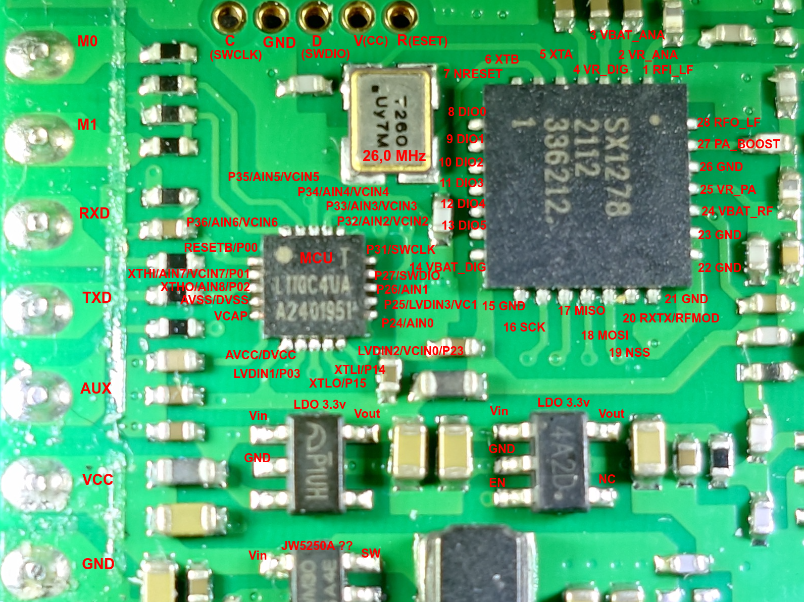
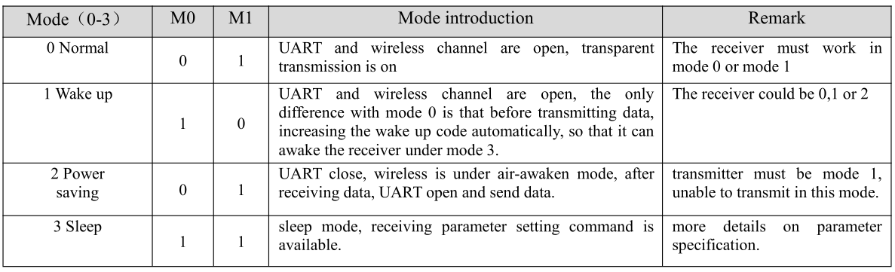
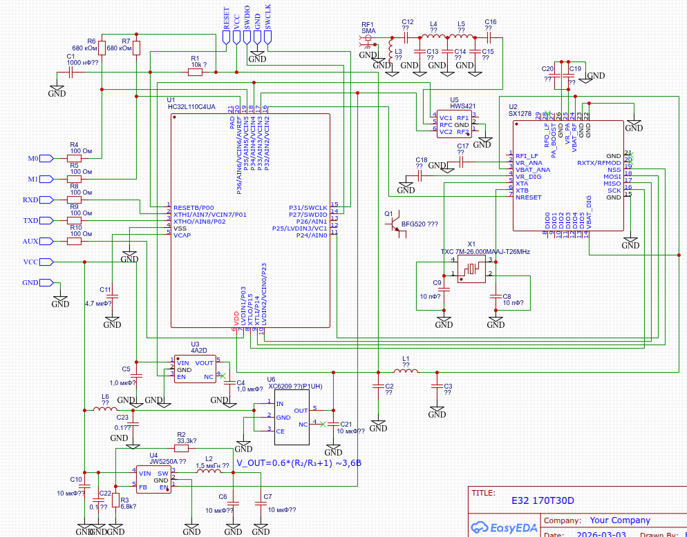

# Приемник AIS на базе модуля [E32 170T30D](https://www.cdebyte.com/products/E32-170T30D/1) от EByte

## Задачи
1. Определиться с архитектурой приемника: один MCU+USB мост, два MCU и тп
2. Разобраться с программированием и прошивкой MCU HL32L110
3. Отладить прием реального AIS сигнала с преобразованием в NMEA 0183
4. Измерить основные характеристики: чувствительность, потребляемая мощность и тп 

### Софт
1. Операционная система Ubuntu Ubuntu 24.04.3 LTS
2. Visual Studio Code v1.108.2 с Platformio v 3.3.4
3. [EasyEDA](https://easyeda.com/) онлайн IDE для разработки радиосхем

## Железо
1. Плата [E32 170T30D](https://www.cdebyte.com/products/E32-170T30D/1)
2. Плата ESP32 doit-devkit-v1

## Определяемся с архитектурой
### Схема (частично) модуля E32 170T30D

Первичный обзор платы был приведен [здесь](https://github.com/wla-da/ais_lab_tools/blob/main/rf/README.md). В моем варианте платы используется радиочип [SX1278](https://github.com/wla-da/ais_lab_tools/blob/main/rf/datascheet/SX1278.pdf) и MCU [HC32L110C4UA](https://github.com/wla-da/ais_lab_tools/blob/main/rf/datascheet/HC32L110SeriesDatasheet_Rev2.70.pdf). 

#### С чем предстоит разобраться?
1. Понять разводку между радиочипом SX1278 и MCU HC32L110C4UA
2. Оценить, будет ли способен MCU HC32L110C4UA "на лету" декодировать AIS поток с преобразованием в NMEA 0183
3. Провести эксперименты по приему сигнала AIS, сделать кастомную прошивку HC32L110C4UA

Для работы радиочипа SX1278 в Continuous mode (а не в пакетном режиме, как необходимо для LoRa) и аппаратном детектировании [AIS преамбулы](https://github.com/wla-da/ais_lab_tools/blob/main/demod/README.md#2-преамбула) необходимо считывать состояния выводов:
* DIO0 (или другой DIO3, DIO4, DIO5 - назначается программно через регистр) — Preamble Detect/Sync Address Detect, обнаружение преамбулы/синхрослова
* DIO1 — DCLK, Data Clock, битовая синхронизация
* DIO2 — Data, сырой битовый поток 
  
Опционально:
* DIO5 — Mode Ready/ClkOut, состояние чипа/тактирование

#### Фото платы крупным планом


Рис 1. Фото MCU и SX1278 крупным планом

На плате (сверху на фото) выведен разъем SWD (Serial Wire Debug) для перепрошивки MCU с подключением напрямую к P27 (SWDIO), P31 (SWCLK) и P00 (RESET) MCU.  Таким образом, можно не заморачиваться с режимом ISP (In-System Programming), утилиты HDSC ISP Tool которого от производителя MCU HDSC (Huada Semiconductor, также известного как XHSC) есть только под Windows. Хотя ISP работает по обычному UART через P35 (TXD MCU → RXD адаптера) и P36 (RXD MCU → TXD адаптера), которые выведены на плате в виде разъемов M0 и M1 соответственно. Еще потребуется вывод RESET (P00) для сброса MCU, который выведен на SWD разъем на плате. Через ISP и UART прошивается проект [PenguinLRS](https://github.com/Penguin096/PenguinLRS/) под схожую плату от Ebyte.

После включения питания не забываем заземлить вход M0 платы, чтобы перевести радиомодуль из режима Sleep в Normal, см таблицу режимов работы. Так же стоит проверить выход платы AUX, должна быть логическая 1: плата готова к работе.


Рис 2. Таблица режимов работы E32-170T30D в зависимости от уровней M0 и M1

#### Схема подключения SX1278 и MCU на плате E32 170T30D 


Рис 3. Принципиальная схема (частично!) платы E32-170T30D 

Из особенностей платы E32 170T30D
1. Имеет 3 стабилизатора напряжения:  
    * LDO с обозначением "P1UH" (похож на XC6209) для питания MCU и радиочипа, работает постоянно
    * LDO 4A2D с управлением (вкл/выкл) от MCU (P34) для питания LNA для приемника 
    * импульсный мощный DC-DC конвертор предположительно на чипе наподобие JW5250A для отдельного RF усилителя мощности с управлением (вкл/выкл) от MCU (P33)
2. Есть отдельный LNA на базе предположительно NPN RF-транзистора наподобие BFG520
3. Есть отдельный усилитель мощности на базе, предположительно, RF-транзистора, идентифицировать модель которого не получилось
4. Есть RF ключ HWS421 для коммутации Rx/Tx с двумя входами управления, подключенными к P34 и P33 MCU (пины теже самые, что управляют вкл/выкл стабилизаторами напряжений)
5. Управлением режимов Rx/Tx занимается MCU, а не SX1278, вывод RXTX/RFMOD (20) у SX1278 не подключен к цепям
6. Установлен кварц на 26 МГц ровно, а не стандартный по даташиту [SX1278](https://github.com/wla-da/ais_lab_tools/blob/main/rf/datascheet/SX1278.pdf) кварц на 32 МГц. Да, я измерял частоту осциллографом, надпись на детали "T260" именно о частоте кварца.
7. Выводы DIO0-DIO5 SX1278 не подключены к цепям
8. Выведен разъем SWD для перепрошивки MCU с подключением напрямую к P27 (SWDIO), P31 (SWCLK) и P00 (RESET) MCU
9. У MCU остаются не задействованными P25 и P26


### Базовый алгоритм
1) настраиваем физический уровень (частота канала AIS, битрейт, BT и тп) 
2) включаем пакетный режим, бит-синхронизатор в этом случае включается автоматически
3) устанавливаем детект преамбулы для AIS (скорее 2 байта из 3х, чтобы ловило и слабые сигналы) с учетом NRZI: 0xCC 0xCC 0xCC или 0x33 0x33 0x33
4) включаем автоподостройку частоты с автоматическим сбросом AfcAutoClearOn = 1, т.к. преамбула задана - AFC должна работать корректно 
5) опционально, задаем синхрослово в виде флага AIS 0x7E с учетом NRZI: 0xFE или 0x01
6) задаем фиксированную длину сообщения в 64 байта (обработка более длинных AIS сообщений - на будущее, пока игнорируем) 
7) выключаем проверку CRC 
8) ждем заполнения FIFO по флагу RxDone или PayloadReady или через регулярный опрос RegIrqFlags, затем читаем FIFO и передаем на UART для последующего декодирования (NRZI, бит дестаффинг, CRC, nmea и тп) на внешнем MCU

И всё было бы хорошо, если бы SX1278 поддерживал установку кастомной преамбулы. Но чип умеет обнаруживать преамбулу только с фиксированной последовательностью байт: либо 0x55 либо 0хAA (конкретное значение выбирается битом в регистре). А в нашем случае преамбула в эфире существует в виде NRZI кодированной строки 0xCC 0xCC 0xCC или 0x33 0x33 0x33. Как следствие, не работает детектор преамбулы, не работает (корректно) AFC по преамбуле (так зависит от работы FEI - Frequency Error Indicator), не работает (корректно) бит-синхронизатор:

```
Для обеспечения корректной работы FEI:
* Измерение должно быть начато во время приема преамбулы.
* Сумма частотного смещения и полосы пропускания сигнала 20 дБ должна быть меньше полосы пропускания фильтра основной полосы, т.е. должен быть принят весь модулированный спектр.

.....

Для обеспечения корректной работы битового синхронизатора должны быть соблюдены следующие условия:
* Для синхронизации требуется преамбула (0x55 или 0xAA) длиной не менее 12 бит; чем длиннее фаза синхронизации, тем лучше будет последующая скорость обнаружения пакетов.
* Последующий битовый поток полезной нагрузки должен иметь как минимум один переход по фронту (восходящий или нисходящий) каждые 16 бит во время передачи данных.
* Абсолютная ошибка между скоростью передачи и приема битов не должна превышать 6,5%.
```

Остается попробовать по сути два варианта:
1. В пакетном режиме выключить детектор преамбулы, включить бит-синхронизатор, включить запуск AFC/AGC по RSII, настроить синхрослово как преамбула+флаг HDLC пакета в кодировке NRZI: 0xCC 0xCC 0xCC 0xFE (альтернативно 0x33 0x33 0x33 0x01).Из плюсов - не нужно паять/менять модуль E32 170T30D. Предположительно, это даст весьма посредственный результат из-за нестабильной работы бит-синхронизатора. 
   
2. В непрерывном режиме включить запуск AFC/AGC по RSII и выключить:
    * детектор преамбулы 
    * поиск синхрослова 
    * бит-синхронизатор <br/>
Читать сырые данные с выхода DIO2 с оверсэмплингом х8/х16 и восстанавливать тактовую частоту бит уже в MCU (по сути, выполнить clock recovery). Дополнительно, нужно припаять DIO2 к свободному пину MCU. Предположительно, это даст максимальный эффект для приема AIS сигнала с помощью SX1278.  

Отдельный пункт - обязательно нужно ставить TXCO, так как 10-20 ppm температурного дрейфа обычного кварца делают прием почти невозможным, особенно в нашем случае, когда выключен AFC.


### TODO
Провести эксперименты по включению автоподстройки частоты (AFC)

FEI - Frequency Error Indicator, разница между несущей частотой принятого сигнала и текущей настройкой синтезатора частоты чипа

Процесс измерения FEI:
* Когда чип находится в режиме приема и обнаруживает преамбулу сигнала, он запускает измерение частотной ошибки
* Измерение занимает 4 битовых периода 
* Результат сохраняется в регистре RegFei в виде 16-битного знакового числа (дополнительный код)
  
`Frequency Error (Hz) = FEI_Value * Fstep, где Fstep = FXOSC / 2^19`

Два режима работы AFC:
* С очисткой (AfcAutoClearOn = 1): каждое новое измерение начинается с исходной (запрограммированной) частоты
* Без очистки (AfcAutoClearOn = 0): коррекция накапливается от предыдущего измерения (полезно при медленном дрейфе, например от температуры)

Когда включен режим AFC (AfcAutoOn = 1), происходит следующее:
* При каждом переходе в режим приема измеряется FEI
* Измеренное значение автоматически вычитается из регистра несущей частоты (FRF)
* Важный нюанс: коррекция применяется только на время текущего сеанса приема

Полоса пропускания AFC:
``` 
AFCbandwidth >= 2 * (Fshift + bitrate/2) + Ferror,
где:
Fshift - девиация частоты (для AIS: ±2400 Гц при GMSK)
bitrate - скорость передачи (9600 бод)
Ferror - максимальная ошибка опорного генератора
``` 


Регистр	Адрес	Назначение	Биты
RegRxConfig	0x0D	Включение AFC и AGC	Бит 4: AfcAutoOn 
RegRxConfig	0x0D	Очистка AFC	Бит 2: AfcAutoClearOn 
RegAfcBw	0x1A	Полоса пропускания для AFC	[citations:2]
RegAfcMsb	0x1E	Старший байт значения AFC	Знаковое число 
RegAfcLsb	0x1F	Младший байт значения AFC	
RegFeiMsb	0x22	Старший байт FEI	Знаковое число 
RegFeiLsb	0x23	Младший байт FEI	


TODO сторожевой таймер в HC32
Аппаратный независимый сторожевой таймер (IWDT - Independent Watchdog Timer):

Как работает: Это самый надежный вариант. IWDT тактируется от собственного внутреннего RC-генератора (частота около 10 кГц), который работает независимо от основного тактирования MCU. Даже если тактовая частота процессора упадет или зависнет, IWDT продолжит тикать.

Управление: Вы задаете временной интервал (например, от долей секунды до нескольких секунд). Программа должна периодически (до истечения таймера) "сбрасывать" (перезагружать) счетчик IWDT командой записи в специальный регистр. Если программа зависнет и перестанет это делать, IWDT сгенерирует аппаратный сброс всего микроконтроллера.


## Сборка патченной версии OpenOCD от [Spritetm](https://github.com/Spritetm/openocd-hc32l110)

1. Установка зависимостей для сборки
Откройте терминал и выполните:

```bash
sudo apt update
sudo apt install git autoconf libtool make pkg-config libusb-1.0-0-dev libhidapi-dev texinfo
```

2. Клонирование репозитория с патчами
```bash
git clone https://github.com/Spritetm/openocd-hc32l110.git
cd openocd-hc32l110
```

3. Конфигурация и сборка
Выполните стандартную процедуру сборки OpenOCD:
```bash
# Сброс конфигурации (если ранее уже была сборка)
make distclean

# Генерация скрипта configure
# Без vpn могут не отрываться некоторые репозитарии, например, https://gitlab.zapb.de/libjaylink/libjaylink.git
# Нужно вручную исправить ULR в openocd-hc32l110/.openocd-hc32l110 на https://github.com/syntacore/libjaylink.git (официальное зеркало) и выполнить `git submodule sync --recursive && git submodule update --init --recursive`
./bootstrap

# Конфигурация для установки в /usr/local (рекомендуется, чтобы не конфликтовать с системным openocd)
./configure --prefix=/usr/local

# Сборка (используйте все ядра процессора для ускорения)
make -j$(nproc)

# Установка собранной версии OpenOCD
sudo make install

# Проверка, что всё собралось корректно, смотрим версию OpenOCD
/usr/local/bin/openocd --version
```

Далее, подключаем ST-Link v2 к USB (сам MCU НЕ подключаем пока), проверяем видимость устройства и права: 
```bash
lsusb | grep -i st-link`
Bus 001 Device 007: ID 0483:3748 STMicroelectronics ST-LINK/V2

ls -la /dev/bus/usb/001/007 # 001 и 007 из предыдущего вывода: Bus 001 Device 007
crw-rw---- 1 root plugdev 189, 6 мар  5 19:31 /dev/bus/usb/001/007 # Устройство /dev/bus/usb/001/007 принадлежит группе plugdev (а не root).

groups $USER
xxx : xxx sudo plugdev # текущий пользователь должен входить в группу plugdev

#убеждаемся, что OpenOCD корректно видит ST-Link v2
/usr/local/bin/openocd -f interface/stlink-v2.cfg -f target/hc32l110.cfg -c "adapter speed 1000" -c "init" -c "halt" -c "shutdown"
Open On-Chip Debugger 0.11.0+dev-g330dc8fda-dirty (2026-03-05-19:09)
Licensed under GNU GPL v2
For bug reports, read
	http://openocd.org/doc/doxygen/bugs.html
WARNING: interface/stlink-v2.cfg is deprecated, please switch to interface/stlink.cfg
DEPRECATED! use 'adapter speed' not 'adapter_khz'
Info : auto-selecting first available session transport "hla_swd". To override use 'transport select <transport>'.
Info : The selected transport took over low-level target control. The results might differ compared to plain JTAG/SWD
adapter speed: 1000 kHz

Info : clock speed 1000 kHz
Info : STLINK V2J37S7 (API v2) VID:PID 0483:3748
Info : Target voltage: 3.286400
Error: init mode failed (unable to connect to the target)
```


## TODO Идеи улучшения
1. Использовать TXCO кварц, отклонение частоты (дрейф и тп) должно быть меньше 1/3 частоты девиации, т.е. не больше 500-700 Гц (!)
2. На входе узкополосный полосовой фильтр на 162 МГц
3. Методы ЦОС: восстанавление тактирования, автоподстройка частоты (компенсация)
4. Полоса пропуская 25 кГц - но ухудшает SNR
5. Использовать LNA с высоким усилением и с уровнем шума не более 1-1,5 дБ
6. Чувствительность выше ~120 дБм на практике смысла не умеет: предел: -174 + 10Log(BW) = -174 + 41 = ~ -133 дБм + SNR(10-12 дБ)
7. Улучшение антенны и фидера: лучшая согласованность, несколько антенны на разные поляризации (вертикальная/горизонтальная)  
8. Как эксперимент - уменьшить битовую скорость с 9,6 до 4,8 кб/с, см https://community.openmqttgateway.com/t/esp32-and-sx1278-ai-thinker-ra01-and-ra02-reception/2157/1


Разработка трансивера на чипе AX5043
https://notblackmagic.com/bitsnpieces/ax5043/  (VPN)
Можно включить вывод IQ сигнала, как аналоговой, так и цифровой форме!
Может работать принимать/передавать AM/FM (УКВ) напрямую

Although the analog baseband I/Q signals is a very cool feature, the much more exciting one is the digital I/Q mode, the so called DSPMode. This mode, as the name implies, is perfect to interface the AX5043 with a DSP where advanced digital signal processing can be implemented, like unsupported modulations. The AX5043 can even be programmed to output the baseband I/Q signals at different steps of the processing chain, or output any of the tracking variables. There are two ways of getting the digital I/Q signals, either reading them from a register over SPI or through a dedicated digital interface.

Starting with the interface/access of the data, in SPI mode the register DSPMODESHREG (0x06F) should be read to get the DSPMode frame bytes (access to the framing shift register), but the better and faster way is to use the dedicated digital interface. This interface uses the DATA, DCLK, PWRAMP (or ANTSEL) and SYSCLK pins, which will act as the RX bit output, frame sync, TX bit input, and bit clock input/output, respectively. To configure these pins, their respective control registers must be programmed (in the programming manual these are the “Invalid” functions):

For DATA pin: Set PINFUNCDATA (0x23) register to 0x06
For DCLK pin: Set PINFUNCDCLK (0x22) register to 0x06
For PWRAMP pin: Set PINFUNCPWRAMP (0x26) to 0x06 and PINFUNCANTSEL (0x25) to 0x02, or vice-versa
For SYSCLK pin: Set PINFUNCSYSCLK (0x21) to 0x04 if the AX5043 should output the bit-clock (can also be set as bit-clock input or to output lower bit-clock)
Now to actually enable, and set what data should be output in DSPMode, the following three hidden register must be programmed: DSPMODECFG (0x320), DSPMODESKIP1 (0x321) and DSPMODESKIP0 (0x322). The first configures the DSPMode interface, and has the following meaning for each bit: