Далее, автоматизированный перевод с китайского [гайда](HC32%20Programmer%20guide.pdf) по прошивке MCU HD32 от [HDSC](http://www.hdsc.com.cn/) с помощью утилиты ISP HDSC.exe, может содержать неточности.

# Cortex-M онлайн-программатор
## Руководство пользователя

**Применимые продукты**  
Данный продукт поддерживает следующие модели чипов:

| Серия | Модель | Серия | Модель |
|-------|--------|-------|--------|
| HC32M140 | HC32M140F8TA, HC32M140J8TA, HC32M140J8UA, HC32M140KATA | HC32L15 | HC32L150KATA, HC32L150JATA, HC32L150FAUA, HC32L156KATA, HC32L156JATA |
| HC32F146 | HC32F146F8TA, HC32F146J8TA, HC32F146J8UA, HC32F146KATA | HC32L15 | HC32L150KATA, HC32L150JATA, HC32L150FAUA, HC32L156KATA, HC32L156JATA |
| HC32F003, HC32F005 | HC32F003C4UA, HC32F003C4PA, HC32F003C4PB, HC32F005C6UA, HC32F005C6PA, HC32F005C6PB, HC32F005D6UA | HC32L110 | HC32L110C6UA, HC32L110C6PA, HC32L110B6PA, HC32L110C4UA, HC32L110C4PA, HC32L110B4PA |
| HC32L13 | HC32L136K8TA, HC32L136J8TA, HC32L130J8TA, HC32L130F8UA, HC32L130E8PA | HC32F030 | HC32F030K8TA, HC32F030J8TA, HC32F030H8TA, HC32F030F8TA, HC32F030F8UA, HC32F030E8PA |
| HC32F460 | HC32F460JEUA, HC32F460JETA, HC32F460KEUA, HC32F460KETA, HC32F460PETB | HC32F17 | HC32F176PATA, HC32F176MATA, HC32F176KATA, HC32F176JATA, HC32F170JATA, HC32F170FAUA |
| HC32F07 | HC32F072PATA, HC32F072KATA, HC32F072JATA | HC32L17 | HC32L176PATA, HC32L176MATA, HC32L176KATA, HC32L176JATA, HC32L170JATA, HC32L170FAUA |
| HC32F19 | HC32F196PCTA, HC32F196MCTA, HC32F196KCTA, HC32F196JCTA, HC32F190JCTA, HC32F190FCUA | HC32L19 | HC32L196PCTA, HC32L196MCTA, HC32L196KCTA, HC32L196JCTA, HC32L190JCTA, HC32L190FCUA |
| HC32L07 | HC32L072PATA, HC32L072KATA, HC32L072JATA, HC32L073PATA, HC32L073KATA, HC32L073JATA | | |

---

## Оглавление

- [Cortex-M онлайн-программатор](#cortex-m-онлайн-программатор)
  - [Руководство пользователя](#руководство-пользователя)
  - [Оглавление](#оглавление)
  - [1. Введение](#1-введение)
    - [1.1 Обзор](#11-обзор)
    - [1.2 Обзор подключения](#12-обзор-подключения)
    - [1.3 Обзор работы программного обеспечения](#13-обзор-работы-программного-обеспечения)
  - [2. Быстрый старт](#2-быстрый-старт)
  - [3. Описание операций](#3-описание-операций)
    - [3.1 Настройки MCU](#31-настройки-mcu)
    - [3.2 Информация о Flash-памяти MCU](#32-информация-о-flash-памяти-mcu)
    - [3.3 Автоматическая нумерация](#33-автоматическая-нумерация)
    - [3.4 Операции](#34-операции)
      - [\<Универсальные операции\>](#универсальные-операции)
      - [\<Универсальные функции защиты\> (для всех чипов, кроме HC32F460)](#универсальные-функции-защиты-для-всех-чипов-кроме-hc32f460)
      - [\<Функции защиты для чипа HC32F460\>](#функции-защиты-для-чипа-hc32f460)
    - [3.5 Отображение информации](#35-отображение-информации)
    - [3.6 Работа через командную строку](#36-работа-через-командную-строку)
  - [4. Обработка ошибок](#4-обработка-ошибок)
    - [4.1 Предупреждения](#41-предупреждения)
    - [4.2 Ошибки](#42-ошибки)
  - [5. Информация о версии и контакты](#5-информация-о-версии-и-контакты)

---

## 1. Введение

### 1.1 Обзор

CM ISP (Cortex-M In-System Programmer) — это программное обеспечение для внутрисхемного программирования, предназначенное для микроконтроллеров серии Cortex-M производства компании Huada Semiconductor (HDSC). Программа поддерживает все продукты HDSC на базе ядра Cortex-M. В данном документе описаны методы использования программного обеспечения для программирования (HDSC.exe) и важные замечания по процессу программирования.

Документ актуален для версии программного обеспечения онлайн-программатора **V2.02**.

### 1.2 Обзор подключения

При использовании программного обеспечения CM ISP (HDSC.exe) модуль последовательного порта подключается к целевому MCU, как показано на рисунке 1.

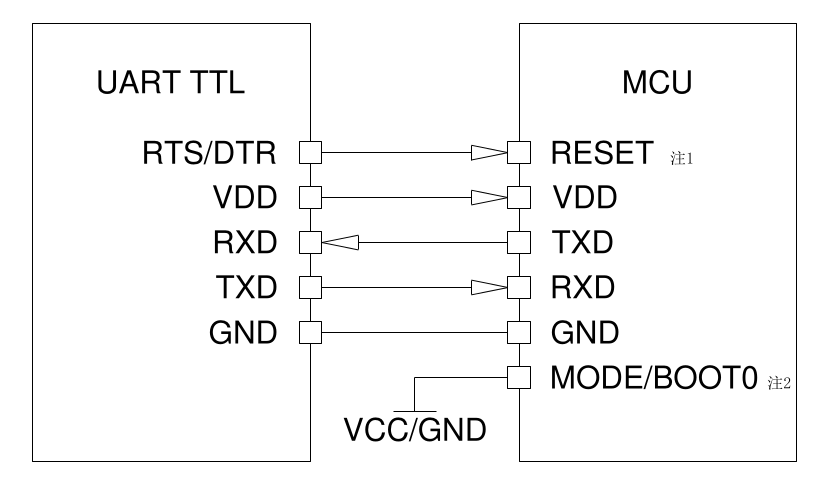
Рисунок 1: Схема подключения модуля UART к целевому MCU

**Сначала подключаем целевой MCU к модулю последовательного порта, затем модуль к ПК.**

> **Примечания:**
> 1) Для серий **HC32x00x** и **HC32x11x** отсутствует вывод MODE/BOOT0. При последовательном программировании необходимо подключить вывод RTS или DTR модуля последовательного порта к выводу **RESET** целевого MCU.
> 2) Способ подключения вывода MODE/BOOT0 может отличаться для разных моделей чипов. Подробности см. в Таблице 1.

**Таблица 1: Методы подключения модуля последовательного порта к конкретным моделям чипов**

| Выводы модуля UART | MCU: HC32x00x | MCU: HC32x11x | MCU: HC32x460 | MCU: HC32x03x | MCU: HC32x13x | MCU: HC32x14x | MCU: HC32x15x | MCU: HC32x07x | MCU: HC32x17x | MCU: HC32x19x |
|-------------------|---------------|---------------|---------------|---------------|---------------|---------------|---------------|---------------|---------------|---------------|
| **VCC / Питание** | VCC | VCC | VCC | VCC | VCC | VCC | VCC | VCC | VCC | VCC |
| **GND / Земля** | GND | GND | GND | GND | GND | GND | GND | GND | GND | GND |
| **RXD** | P31/P35 | P31/P35 | PA13 | PA09/PA14 | PA09/PA14 | P11 | P12 | PA14 | PA14 | PA14 |
| **TXD** | P27/P36 | P27/P36 | PA14 | PA10/PA13 | PA10/PA13 | P12 | P11 | PA13 | PA13 | PA13 |
| **RTS/DTR → MODE/BOOT0/RESET** | RESET | RESET | MODE | MODE | MODE | MODE | MODE | BOOT0 | BOOT0 | BOOT0 |

### 1.3 Обзор работы программного обеспечения

**Таблица 2: Системные требования для запуска программного обеспечения программатора**

| Параметр | Требования |
|----------|-----------|
| Операционная система | Windows 7, Windows 8, Windows 10 |
| Версия .NET Framework | .NET Framework 4.0 или выше |

Для запуска программного обеспечения на компьютере должна быть установлена среда **Microsoft .NET Framework версии 4.0 или выше**. Проверьте наличие Framework 4.0 в системном пути `C:\Windows\Microsoft.NET\Framework(64)`, как показано на Рисунке 2.

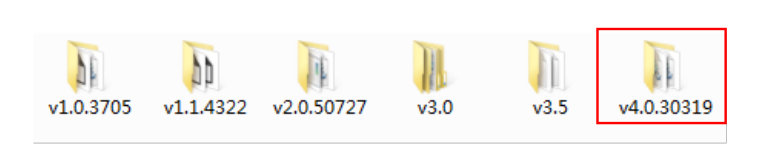
Рисунок 2: Проверка наличия .NET Framework 4.0

Если среда не установлена, загрузите соответствующую версию с официального сайта Microsoft.

**Структура каталога программного обеспечения онлайн-программатора** показана на Рисунке 3.

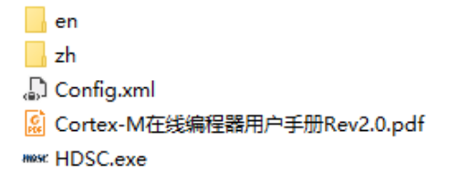
Рисунок 3: Структура файлов онлайн-программатора

- Папки `en`, `zh` содержат файлы конфигурации локализации интерфейса (переключение между английским и китайским языками). Не являются обязательными.
- Файл `Config.xml` — пользовательский конфигурационный файл. Создается автоматически после закрытия программы для сохранения настроек пользователя. При первом использовании отсутствует.
- Файл `Cortex-M 在线编程器用户手册 Rev2.0.pdf` — файл руководства пользователя. Открывается через меню «Помощь» в интерфейсе программы.
- Файл `HDSC.exe` — исполняемый файл программы. Может запускаться самостоятельно, но без поддержки переключения языков (только английский интерфейс).

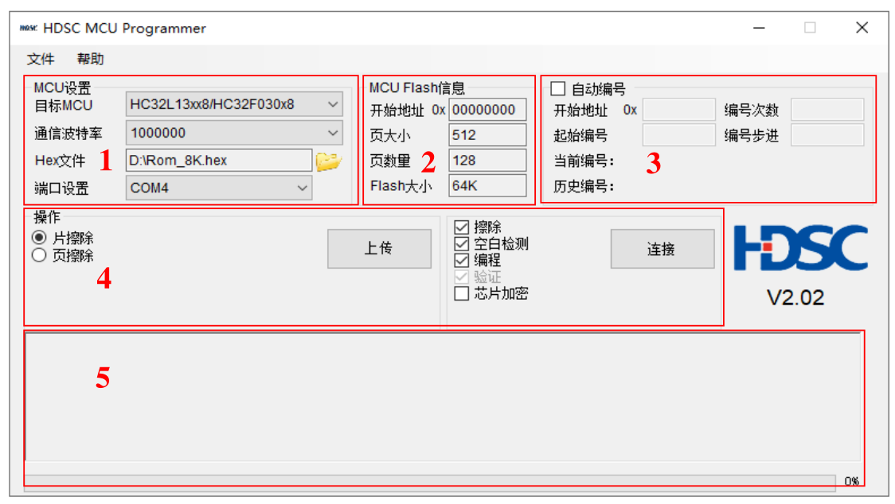
Рисунок 4: Интерфейс программного обеспечения (вариант 1)

**Элементы интерфейса:**

1) **Настройки MCU**: Выбор модели целевого MCU, частоты кварцевого генератора (для серий HC32L15xxA, HC32L15xx8, HC32F146xA/HC32M140xA и HC32F146x8/HC32M140x8) или скорости передачи данных (для остальных серий), выбор HEX-файла для прошивки и номера COM-порта ПК.

2) **Информация о Flash-памяти MCU**: Отображение параметров выбранного MCU: начальный адрес, размер страницы, количество страниц и общий объём Flash-памяти.

3) **Автоматическая нумерация**: Функция присвоения уникальных номеров программируемым MCU.

4) **Операции**: Разделён на две части:
   - **Загрузка (Upload)**: Считывание данных из Flash-памяти целевого MCU и сохранение в виде .hex-файла на ПК.
   - **Подключение (Connect)**: Выбор операций: стирание, проверка на пустоту, программирование (с верификацией), шифрование чипа. После выбора операций нажмите кнопку «Подключить».

5) **Отображение информации**: Вывод сообщений о ходе программирования и результатах операций.

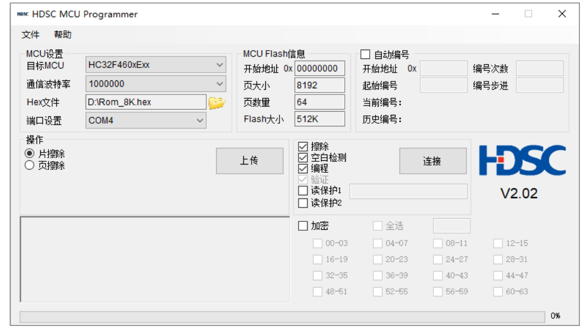
Рисунок 5: Интерфейс программного обеспечения для HC32F460xExx

> При выборе целевого MCU **HC32F460xExx** в интерфейсе отображаются дополнительные функции: **Защита от чтения 1**, **Защита от чтения 2** и **Шифрование**.  
> - Для **Защиты от чтения 1** требуется ввод пароля.  
> - Для функции **Шифрование** необходимо задать диапазон шифрования Flash-памяти.

---

## 2. Быстрый старт

Ниже описана процедура быстрого программирования:

1) Подключите кабель преобразователя USB–UART к выводам последовательного программирования целевого MCU. Пример подключения для серии **HC32L136** показан на Рисунке 6. Вывод **MODE** целевого MCU должен быть подтянут к питанию, после чего подайте питание на MCU для входа в режим последовательного программирования.

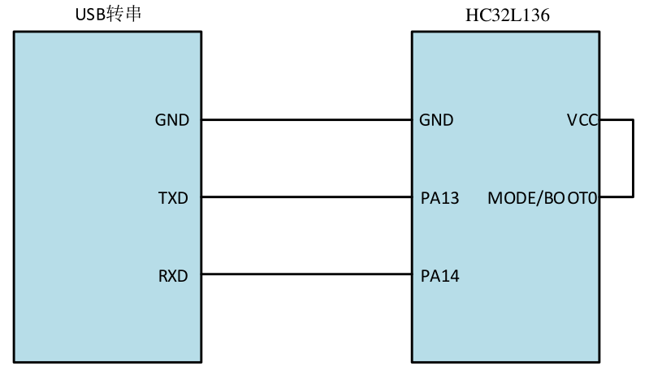
Рисунок 6: Схема аппаратного подключения для HC32L136

| USB–UART адаптер | Целевой MCU (HC32L136) |
|-----------------|------------------------|
| GND | GND |
| TXD | PA13 |
| RXD | PA14 |
| — | VCC |
| — | MODE/BOOT0 (подтянут) |

2) Соедините ПК и целевую плату с MCU с помощью кабеля USB–UART. Запустите программное обеспечение, выберите модель целевого MCU, настройте скорость передачи данных, укажите HEX-файл для программирования и выберите соответствующий COM-порт.

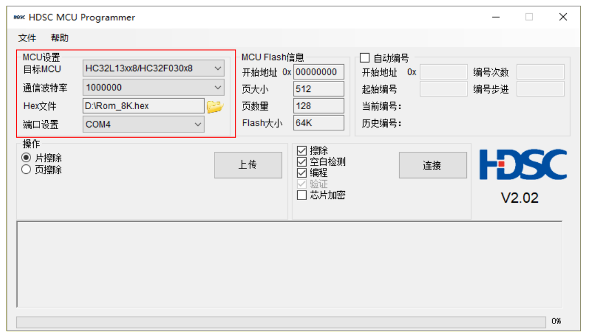
Рисунок 7: Настройки MCU в интерфейсе программы

3) Выберите необходимые операции. Например, отметьте галочками: «Стирание», «Проверка на пустоту», «Программирование (с верификацией)», как показано на Рисунке 8.

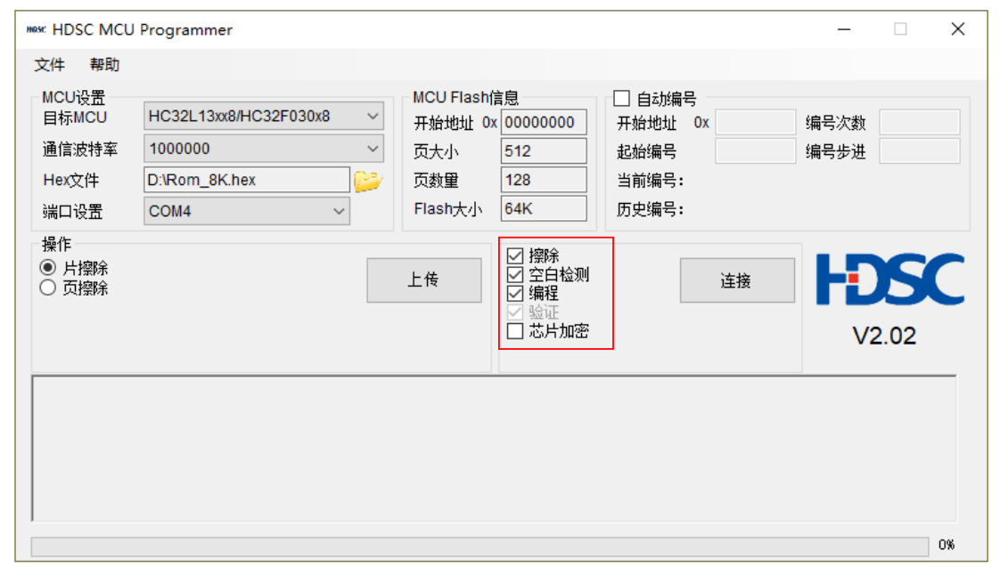
Рисунок 8: Выбор операций программирования

4) Нажмите кнопку **«Подключить»** для начала программирования и дождитесь завершения процесса.

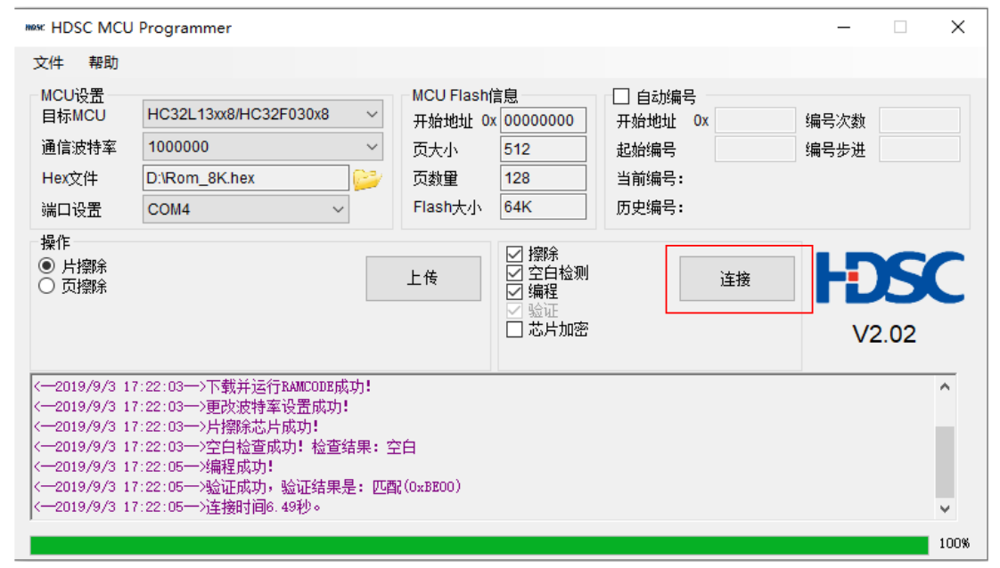
Рисунок 9: Запуск операции программирования

---

## 3. Описание операций

### 3.1 Настройки MCU

Настройка параметров целевого MCU: выбор модели, установка частоты кварцевого генератора или скорости передачи данных, выбор HEX-файла и номера последовательного порта.

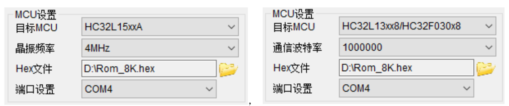
Рисунок 10: Интерфейс настройки MCU

1) **Целевой MCU**: Выпадающий список содержит все текущие модели MCU HDSC на базе ядра ARM Cortex-M. Выберите модель, соответствующую программируемому чипу.

2) **Частота кварцевого генератора или скорость передачи**:  
   - Для серий **HC32L15xxA**, **HC32L15xx8**, **HC32F146xA/HC32M140xA** и **HC32F146x8/HC32M140x8** — настройка частоты внешнего кварцевого резонатора целевого MCU.  
   - Для остальных серий — настройка скорости передачи данных (Baud Rate) выбранного COM-порта.

3) **HEX-файл**: Выбор файла в формате Intel HEX для программирования.

4) **Настройка порта**: Выбор номера COM-порта для ISP-подключения.

### 3.2 Информация о Flash-памяти MCU

Отображение параметров Flash-памяти выбранной модели MCU: начальный адрес, размер страницы, количество страниц и общий объём Flash.

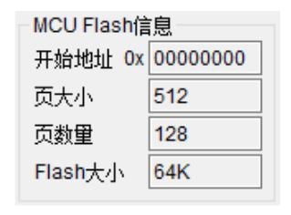
Рисунок 11: Отображение параметров Flash-памяти MCU

### 3.3 Автоматическая нумерация

Программное обеспечение поддерживает функцию автоматического присвоения уникальных номеров при программировании MCU. Для активации функции выберите переключатель **«Автоматическая нумерация»** в соответствующей группе.

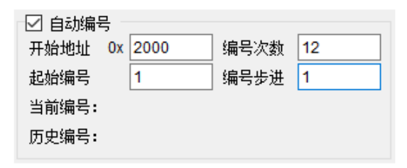
Рисунок 12: Включение функции автоматической нумерации

После выбора «Автоматическая нумерация» функция активируется. Заполните следующие параметры:

| Параметр | Описание |
|----------|----------|
| **Начальный адрес** | Адрес во Flash-памяти MCU, куда будет записан номер. Занимает 4 байта. Должен находиться в допустимом диапазоне адресов Flash для выбранной модели (адрес указывается в шестнадцатеричном формате, символы 0–F). |
| **Количество нумераций** | Сколько уникальных номеров необходимо записать. Должно быть > 0. Диапазон: 1–999 999. |
| **Стартовый номер** | Начальное значение нумерации. Диапазон: 0–99 999 999. |
| **Шаг нумерации** | Инкремент между последовательными номерами. Должен быть > 0. Диапазон: 1–999. |
| **Текущий номер** | Отображение номера, записываемого в текущей операции программирования. |
| **Исторический номер** | Отображение последнего успешно записанного номера. |

### 3.4 Операции

Данный раздел содержит основные функции программного обеспечения: загрузка, стирание, проверка на пустоту, программирование (с верификацией) и шифрование чипа.

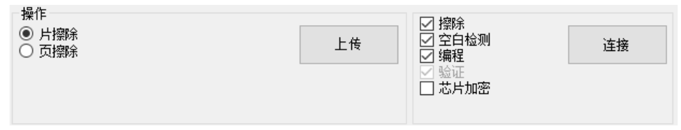
Рисунок 13: Панель операций

> При выборе целевого MCU **HC32F460xExx** дополнительно отображаются функции: **Защита от чтения 1**, **Защита от чтения 2** и **Шифрование**.

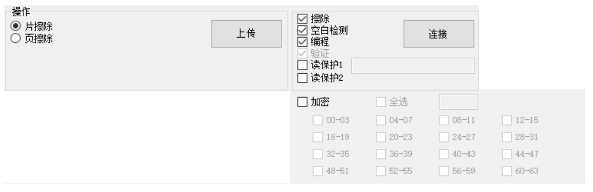
Рисунок 14: Дополнительные операции для HC32F460xExx

#### <Универсальные операции>

| Операция | Описание |
|----------|----------|
| **Загрузка (Upload)** | Считывание всего содержимого Flash-памяти MCU и сохранение на ПК. Может использоваться для сравнения или резервного копирования. |
| **Стирание** | Поддерживает два режима: **полное стирание чипа** (Chip Erase) и **постраничное стирание** (Page Erase) только тех страниц, которые используются в загружаемом HEX-файле. |
| **Проверка на пустоту** | Проверка всей области Flash-памяти на состояние «пусто» (все байты = 0xFF). |
| **Программирование** | Запись данных из HEX-файла во Flash-память MCU. |
| **Верификация** | Проверка корректности записанных данных путём сравнения с исходным HEX-файлом. |

#### <Универсальные функции защиты> (для всех чипов, кроме HC32F460)

| Функция | Описание |
|---------|----------|
| **Шифрование чипа** | Защита данных во Flash-памяти от несанкционированного считывания. После активации данные не могут быть прочитаны внешними средствами. |

#### <Функции защиты для чипа HC32F460>

| Функция | Описание |
|---------|----------|
| **Защита от чтения 1** | Защита области FLASH от несанкционированного чтения. После активации доступ к данным возможен только при предоставлении корректного ключа. |
| **Защита от чтения 2** | Полная защита области FLASH от чтения. После активации данные невозможно прочитать никакими средствами, включая отладчики. |
| **Шифрование** | Криптографическая защита данных FLASH для предотвращения атак методом физического анализа. При выборе опции «Программирование» и активации «Шифрование» с указанием диапазонов секторов, данные в указанных секторах шифруются после успешной записи. |

### 3.5 Отображение информации

Область для вывода сообщений о ходе выполнения операций, прогресс-баров и результатов программирования.

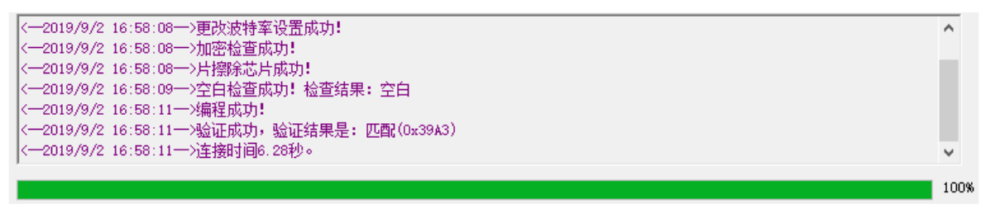
Рисунок 15: Область отображения информации

### 3.6 Работа через командную строку

Программное обеспечение поддерживает запуск из командной строки (CMD.exe) или вызов из сторонних приложений.

**Пример использования в CMD.exe:**

1) Откройте CMD.exe и перейдите в каталог, содержащий файл `HDSC.exe` (Рисунок 16).

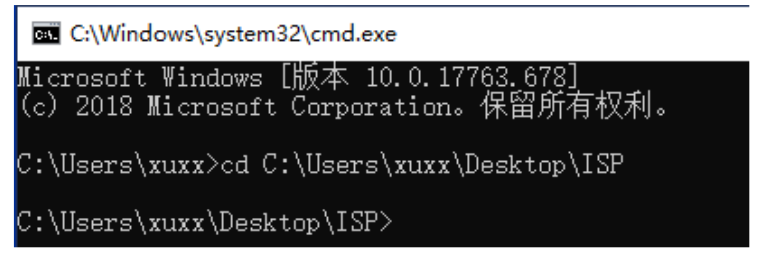
Рисунок 16: Переход в каталог программы

2) Запустите `HDSC`, выполните настройку MCU в графическом интерфейсе, затем закройте программу (Рисунок 17).

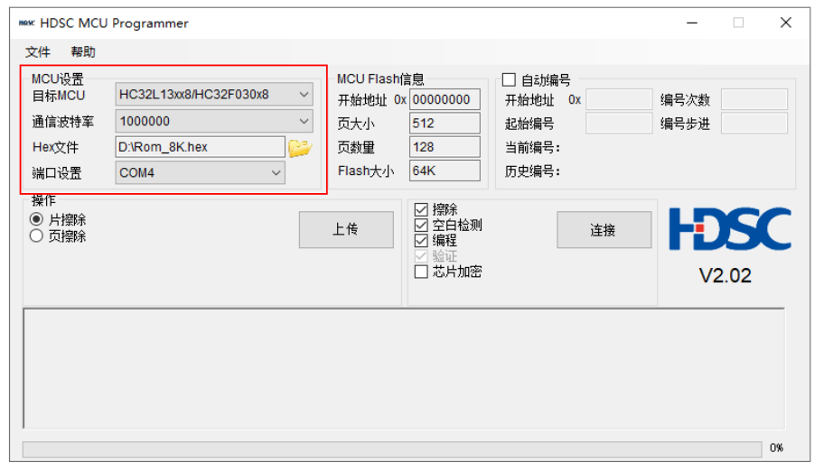
Рисунок 17: Настройка MCU перед командной строкой

1) Вернитесь в CMD.exe и введите `HDSC ?` для отображения списка поддерживаемых команд (Рисунок 18).

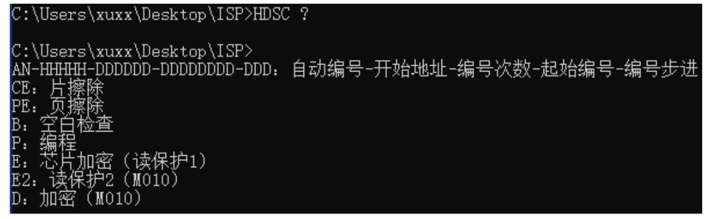
Рисунок 18: Список поддерживаемых команд

**Пример команды:**  
Активировать автоматическую нумерацию с начальным адресом `0x2000`, количеством нумераций `1`, стартовым номером `0`, шагом `1`, а также выполнить полное стирание, проверку на пустоту и программирование: `HDSC AN-2000-1-0-1 CE B P`. Результат выполнения показан на Рисунке 19.

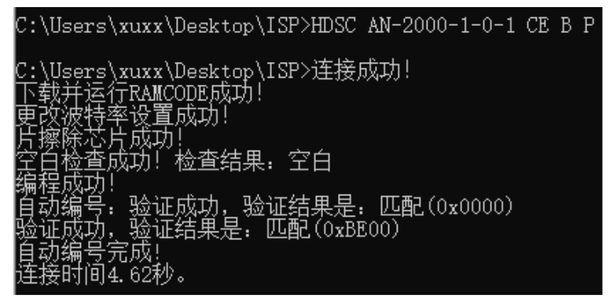
Рисунок 19: Пример вывода результат выполнения команд

**Внимание**:
* Параметры команд должны разделяться пробелами
* Перед выполнением команд убедитесь, что файл конфигурации Config.xml содержит корректные настройки.

## 4. Обработка ошибок

### 4.1 Предупреждения

**Таблица 3: Сообщения предупреждений**

| Сообщение | Описание | Действие |
|-----------|----------|----------|
| **Подключение успешно** | Успешное установление связи с MCU | — |
| **MCU зашифрован, требуется ручной перезапуск. После перезапуска нажмите «Да (Y)»** | Требуется перезагрузить целевой MCU вручную | Перезагрузите MCU, затем нажмите кнопку «Да» для продолжения |
| **Автоматическая нумерация завершена** | Процесс нумерации успешно завершён | — |
| **Адрес автоматической нумерации пересекается с пользовательским кодом. Продолжить?** | Запрашивается подтверждение на запись номера в область, занятую кодом | Нажмите «Да» для продолжения или «Нет» для отмены операции |

### 4.2 Ошибки

**Таблица 4: Сообщения об ошибках**

| Сообщение об ошибке | Описание | Решение |
|---------------------|----------|---------|
| **Выберите HEX-файл для прошивки** | Не указан файл для программирования | Выберите корректный HEX-файл |
| **Неверный путь к файлу или файл недействителен** | Указанный путь не существует, файл повреждён или занят другим процессом | Проверьте путь, убедитесь, что файл существует и не используется |
| **Ошибка формата HEX-файла** | Файл не соответствует спецификации Intel HEX | Проверьте целостность и формат HEX-файла |
| **Ошибка HEX-файла! Размер превышает объём Flash выбранного чипа** | Размер данных в файле превышает доступную Flash-память целевого MCU | Выберите подходящий HEX-файл или правильную модель MCU |
| **На компьютере не обнаружен последовательный порт** | Отсутствует доступный COM-порт | Подключите USB–UART адаптер или настройте виртуальный COM-порт |
| **Тайм-аут операции с портом** | Ошибка связи по последовательному интерфейсу | Проверьте подключение, соответствие прошивки, попробуйте перезапустить MCU |
| **Ошибка чтения** | Не удалось считать данные из MCU | Проверьте аппаратное подключение, соответствие версии прошивки, перезапустите целевое устройство |
| **Flash-память MCU зашифрована** | Данные защищены и не могут быть прочитаны | Для зашифрованных чипов чтение данных невозможно без ключа |
| **Ошибка полного стирания чипа** | Не удалось выполнить Chip Erase | Проверьте подключение, соответствие прошивки, перезапустите MCU |
| **Ошибка постраничного стирания** | Не удалось выполнить Page Erase | Проверьте подключение, соответствие прошивки, перезапустите MCU |
| **Ошибка постраничного стирания: чип зашифрован** | Зашифрованный чип не поддерживает постраничное стирание | Используйте полное стирание чипа (Chip Erase) |
| **Ошибка проверки на пустоту** | Не удалось выполнить проверку | Проверьте подключение, соответствие прошивки, перезапустите MCU |
| **Ошибка обнуления контрольной суммы** | Не удалось выполнить сброс контрольной суммы | Проверьте подключение, соответствие прошивки, перезапустите MCU |
| **Ошибка программирования** | Не удалось записать данные во Flash | Проверьте подключение, соответствие прошивки, перезапустите MCU |
| **Ошибка верификации** | Данные во Flash не совпадают с исходным HEX-файлом | Проверьте подключение, целостность HEX-файла, перезапустите MCU |
| **Параметр не может быть пустым, заполните поле** | Отсутствует обязательный параметр | Заполните все обязательные поля |
| **Ошибка формата параметра, введите заново** | Введённое значение не соответствует ожидаемому формату | Исправьте формат параметра согласно требованиям |
| **Адрес превышает размер Flash выбранного чипа, введите заново** | Указанный начальный адрес выходит за пределы допустимого диапазона | Введите корректный адрес в пределах адресного пространства Flash целевого MCU |

---

## 5. Информация о версии и контакты

**Таблица 5: История версий документа**

| Дата | Версия | История изменений |
|------|--------|------------------|
| 2017-11-10 | Rev1.0 | Первая публикация руководства пользователя Cortex-M онлайн-программатор |
| 2019-04-09 | Rev1.1 | Добавлено описание для версии программного обеспечения V1.4 |
| 2019-04-15 | Rev1.2 | Расширен список поддерживаемых моделей чипов |
| 2019-09-03 | Rev2.0 | Поддержка версии программного обеспечения V2.0 |

**Контактная информация**  
Если у вас есть вопросы, предложения или замечания по покупке и использованию продукта, пожалуйста, свяжитесь с нами:

- **Email**: mcu@hdsc.com.cn  
- **Веб-сайт**: [http://www.hdsc.com.cn/mcu.htm](http://www.hdsc.com.cn/mcu.htm)  
- **Почтовый адрес**: Китай, г. Шанхай, район Чжанцзян, ул. Бибо, д. 572, корп. 39  
- **Почтовый индекс**: 201203

